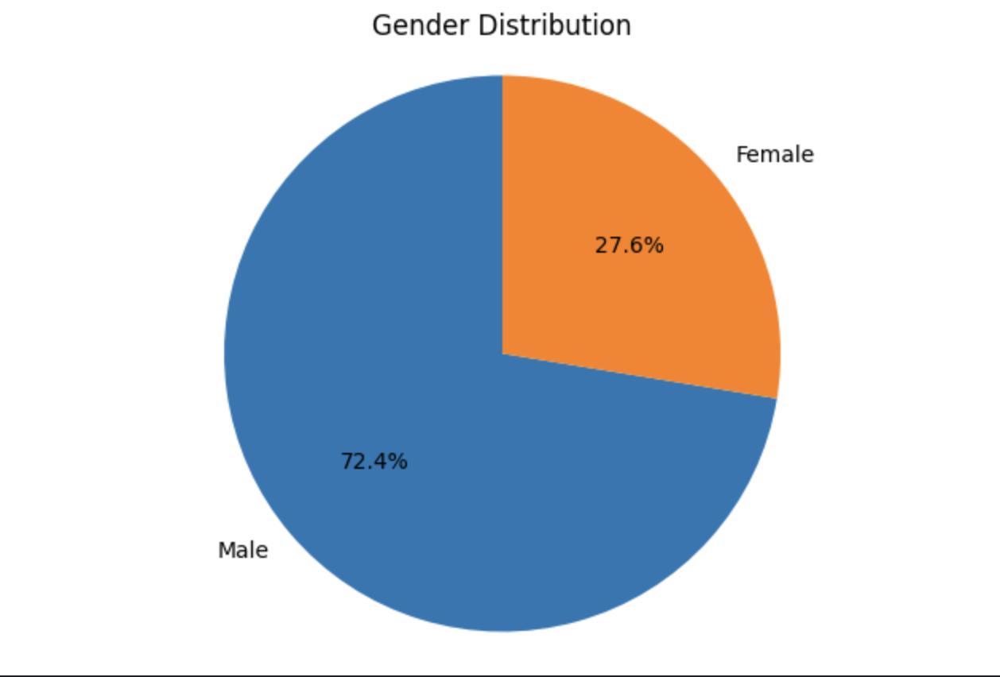

# Gender Distribution and Correlation Analysis Project

## Overview
This project analyzes a dataset that contains information on various factors affecting students' academic experiences. 
The data was pre-cleaned and complete, allowing for a focus on visualization and correlation analysis.

## Objectives
- Visualize the distribution of gender among the participants.
- Identify and analyze the top three highest correlations between different factors in the dataset.

## Dataset
The dataset includes the following columns:
- **gender**
- **age**
- **university**
- **degree_level**
- **degree_major**
- **academic_year**
- **cgpa**
- **residential_status**
- **campus_discrimination**
- **sports_engagement**
- **average_sleep**
- **study_satisfaction**
- **academic_workload**
- **academic_pressure**
- **financial_concerns**
- **social_relationships**
- **depression**
- **anxiety**
- **isolation**
- **future_insecurity**
- **stress_relief_activities**

## Visualization
### Gender Distribution
A pie chart was created to visualize the gender distribution within the dataset. 
The analysis revealed a significant majority of male participants, indicating potential areas for further exploration regarding gender dynamics in academic environments.

## Correlation Analysis
The analysis identified the top three highest correlations in the dataset:
1. **Anxiety and Depression**: Correlation coefficient: 0.84
2. **Depression and Isolation**: Correlation coefficient: 0.71
3. **Isolation and Anxiety**: Correlation coefficient: 0.67

These correlations suggest that [brief interpretation of what these correlations imply about the dataset].

## Conclusion
This project highlights the gender distribution and significant correlations within the dataset, providing insights into the academic experiences of students. 
Future work could explore deeper causal relationships and additional demographic factors.

## Technologies Used
- Python
- Pandas
- Matplotlib/Seaborn for visualization

